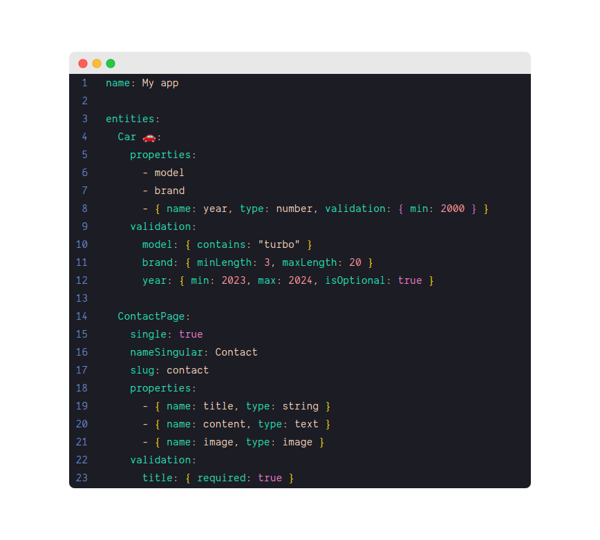
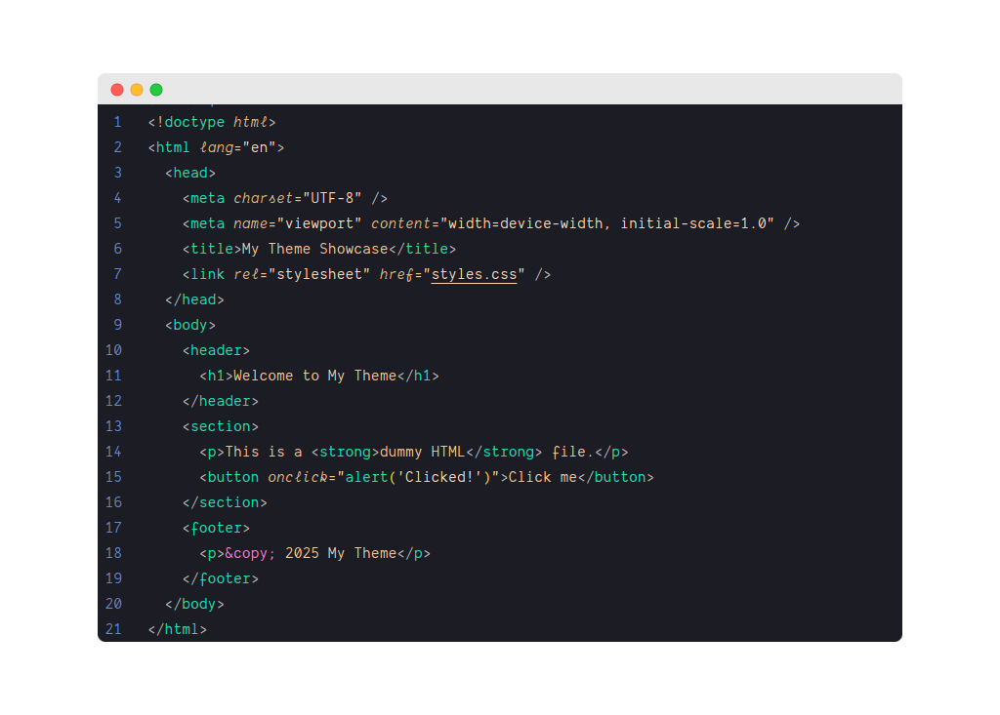
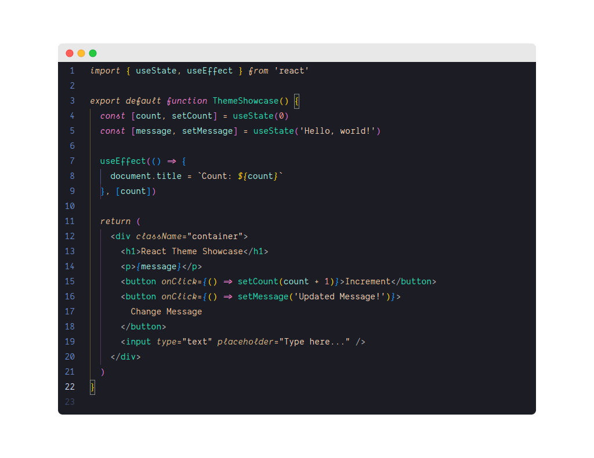
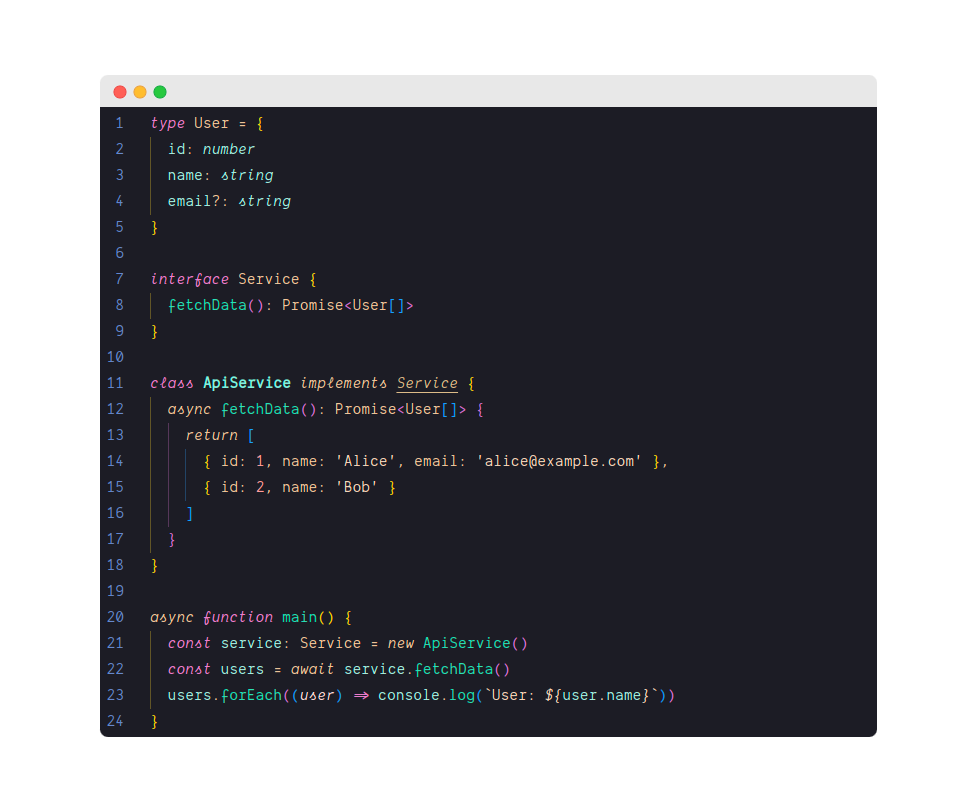
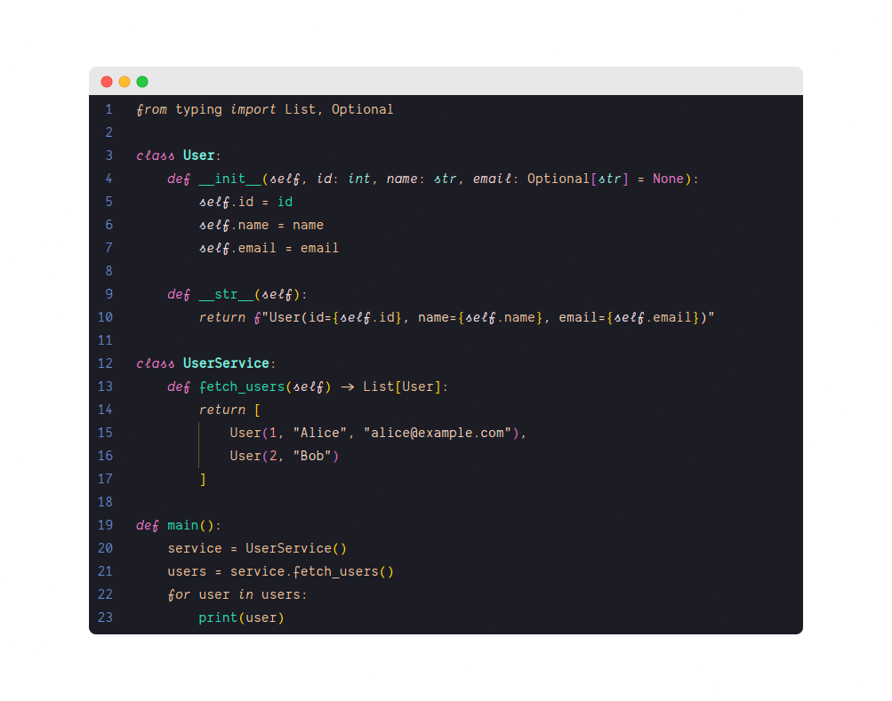
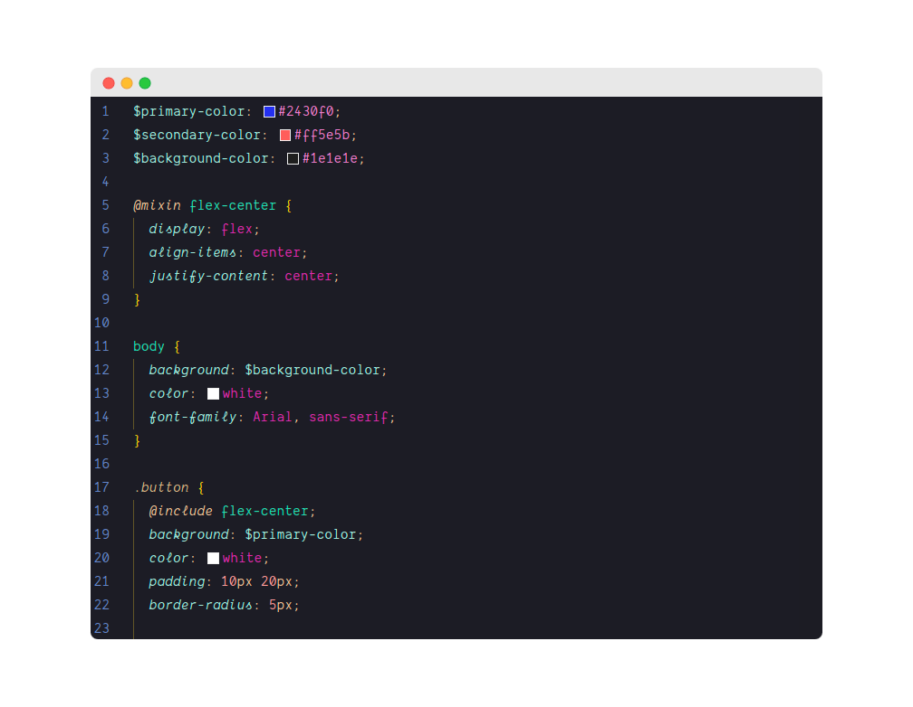

 

  

<strong>Manifest Dark Theme for VS Code</strong>
  

 

## Description

A deep, dark and elegant theme for VS Code inspired by [Manifest](https://manifest.build) color palette.

## Preview

**YAML**

**HTML**

**REACT**

**TypeScript**

**Python**

**SCSS**

## Contribute

If you want to contribute to this repository, please open an issue and create a pull request.
